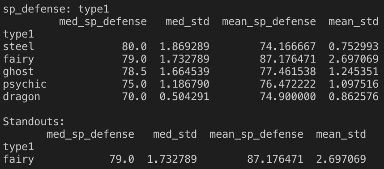
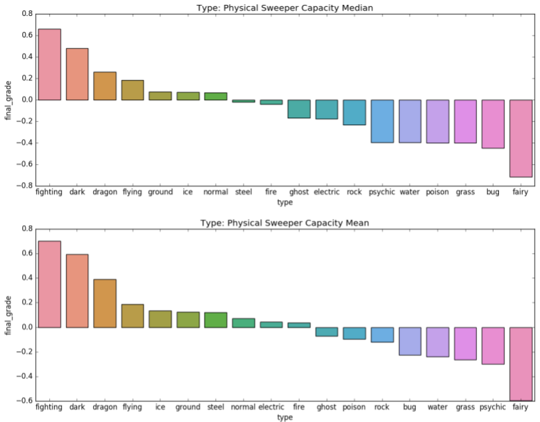

# Pandas_Data_Exploration
This is a Pandas Python exploration of a Pokemon dataset. The dataset was found [here](https://www.kaggle.com/rounakbanik/pokemon) on Kaggle from user: rounakbanik. 

<h2>Intro</h2>
2 roles in a balanced Pokemon party are 'Sweepers' and 'Tanks'. Sweepers are characterized by high speed and high offensive power. Tanks are characterized by high defensive power and high health. 

<h2>Goal</h2>
The hypothesis is that some Pokemon types are more inclined towards certain roles than others. This exploration will aim to reveal trends on whether a relationship between Pokemon types and roles exists. 

<h2>Preprocessing</h2>
Inspecting the dataset, there were missing values in the columns: height, weight, percentage_male, and type2 (secondary Pokemon type). Since only type2 is of concern, I filtered the dataset down to Pokemon names, base stats, and types and filled empty type2 values with 'None'. Legendaries were not considered as they are usually outliers. 

<h2>Exploring</h2>
First, we check the primary and secondary type distribution to see the frequency of each Pokemon type. 

 
 

* ~15% of Pokemon have a primary type of Water. Many bodies of water scattered around the different Pokemon regions gives plenty of opportunity to have different Water Pokemon species. 
* ~14% of Pokemon have a primary type of Normal. The Normal type seems logical as a common type since they are the 'everyday' type and can appear in patches of grass no matter the terrain or weather.  
* Flying is deceivingly low as a primary type as it is the most common secondary type at ~11.6% of Pokemon.  

Now we'll do a cursory look to see which primary Pokemon types seem to excel at which stats. 
 
 
 
 
 
 

<b>HP</b> 
Fairy types appear to have the highest HP as a primary type, and Normal Types have a heavily skewed mean_hp due to Pokemon like Blissey and Chansey with abnormally high HP stats. 

<b>ATK</b> 
Fighting types appear to have the highest ATK amongst the median. They're less of a standout compared amongst the mean. 

<b>DEF</b> 
Steel and Rock type are the strongest in the DEF stat by a large margin. 

<b>SP ATK</b> 
Pokemon types that are strong in SP_ATK appear well-varied across the median; however, Psychic and Fire Pokemon appear to have higher peaks in this stat on average. 

<b>SP DEF</b> 
Steel, Fairy, and Ghosts seem to do well in the SP_DEF stat, but Fairy types on average are much stronger in this base stat. 

<b>SPD</b> 
Flying and Electric types are strongest in SPD. However, a caveat is that there are only 2 Pokemon categorized as a primary Flying type. 

<h2>Defining 'Sweepers' and 'Tanks'</h2>
<b>Sweepers</b> 
Strike hard, Strike first. There are 2 types: Physical and Special. A Sweeper Index will be made to judge a Pokemon's compatibility with the role. 
Offensive stats and Speed stats will be aggregated then standardized to become the Sweeper Grade. 

<b>Tanks</b> 
Reduce and absorb damage. There are 2 types: Physical and Special. A Tank Index will be made to judge a Pokemon's compatibility with the role.  
Defensive stats and HP stats will be aggregated then standardized to become the Tank Grade. 

<h2>Results</h2>
After calculating the Grade values for the Sweeper and Tank roles per Pokemon type (Normal, Water, etc.) and class-type (Type1/Type2), the median and mean the Grade values for all Pokemon types across both class-types were taken and plotted.  

<b>Physical Sweepers: Median/Mean Distribution</b> 

 
<b>Top 10 Physical Sweepers</b> 

 
<b>Physical Sweepers: Takeaways</b> 
* Fighting and Dark types seem to be dominant in the Physical Sweeper role while Dragon is a close runner-up.  
* Fairy types are seemingly one of the worst performing types in this category. 
* Psychics have one of the biggest positional shifts between median and mean, suggesting that Psychics are on average much weaker Physical Sweepers than other types. 
* Beedrill, Heracross, and Pinsir are surprising top Physical Sweepers even though Bug types overall are generally poor performers as Physical Sweepers.  

<b>Special Sweepers: Median/Mean Distribution</b> 

  
<b>Top 10 Special Sweepers</b> 

 
<b>Special Sweepers: Takeaways</b> 
* Fire leads the way as one of the strongest Special Sweepers followed closely by Electric, Normal, and Flying types. 
* Rock, Bug, and Ground types seem to be among the worst performers in this role. 
* Sceptile(Grass) and Lucario(Fighting/Steel) are anomalies. Both are atypical as each has high Special Attack stats as opposed to the average Pokemon of their respective types.  

<b>Physical Tanks: Median/Mean Distribution</b> 

 
<b>Top 10 Physical Tanks</b> 

 
<b>Physical Tanks: Takeaways</b> 
* Rock and Steel are clearly the top runners for Physical Tanks. Aggron and Steelix seem to represent their types well. Normal and Flying types on average appear to be the worst performers.  
* Blissey, Chansey, Slaking, and Wobbuffet are atypical compared to the rest of the Pokemon of their respective types, but perform well due to high HP stats.  

<b>Special Tanks: Median/Mean Distribution</b> 

 
<b>Top 10 Special Tanks</b> 

 
<b>Special Tanks: Takeaways</b> 
* Types that are decent performers in this role are diverse. Fairy, Ice, Fighting, and Psychic Pokemon all have fairly decent Special Defense stats.  
* Bug and Flying types appear to be the worst Special Tanks.  
* Adding to the list of atypical Pokemon, Umbreon, Audino and Snorlax are high-performing Special Tanks even though the majority of their class-type are not that good in the role.   

<h2>Summary</h2>
* Physical Sweepers: Fighting/Dark Type seem like a good place to start for finding a Physical Sweeper.  
* Special Sweepers: Fire types seem to be a strong choice for a Special Sweeper. If more type diversity is needed, look at Electric, Flying, or Normal types 
* Physical Tanks: Rock/Steel are solid types when looking for a Physical Tank. 
* Special Tanks: No specific Pokemon Type really shines here, but Fairy types could be a good place to start looking. 
* <b>Note</b> Ice and Dragons are the only types that have positive grades for all roles, so if you are looking for a well-rounded Pokemon, look at these types. 
This is a visual exploration that hints at trends between roles and types of Pokemon and can hopefully serve as a mini-guide for players to find the right Pokemon for their party when starting a Pokemon game.  
There are some cautions to take when evaluating this exploration. Metrics for determining compatibility of a Pokemon and a role are arguable as players may value different stats or weightings when looking for an offensive Pokemon. 
Additionally, Pokemon like Pinsir placed high as Physical Sweepers on this metric, other features like Moveset Potential as a factor in the Physical Sweeper role were not factored in. 
Overall, type selection is a good start for creating a strong Pokemon team, but there are many other factors to consider. After seeing anomalies like Blissey, Pinsir, Umbreon, etc, one could wonder if type is the best grouping to determine Pokemon best suitable for a role, or if there are other factors or groupings that better detail the trend of good offensive/defensive Pokemon. 

Still interested in reading more about Pokemon trends? <a href="https://github.com/tedglim/data_apps/tree/master/src/kmeans_app">Click here!</a>.
