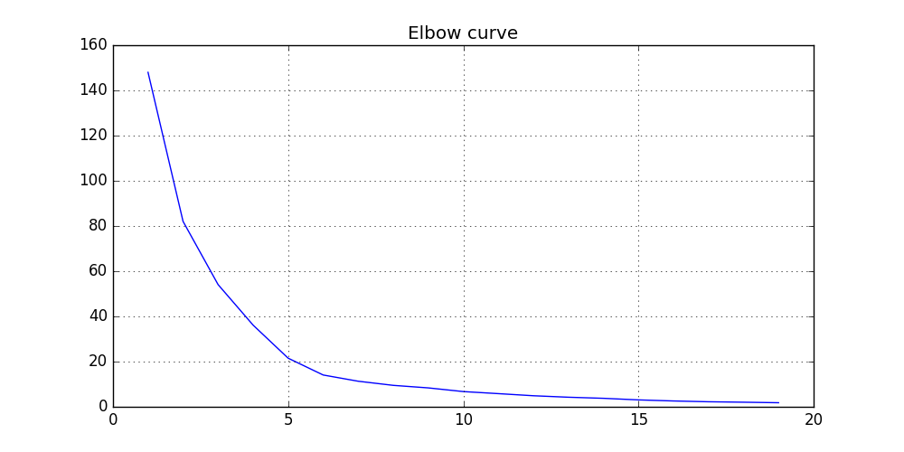
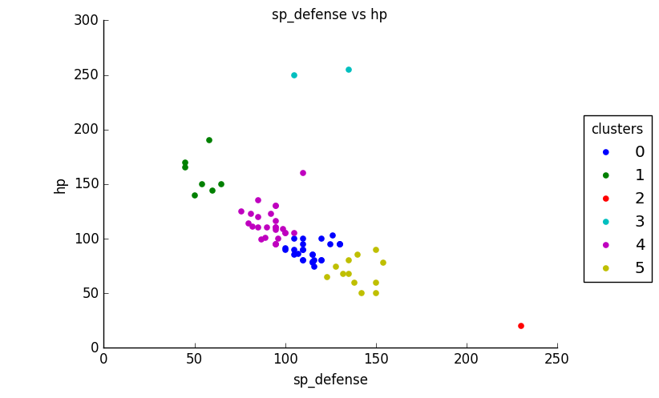
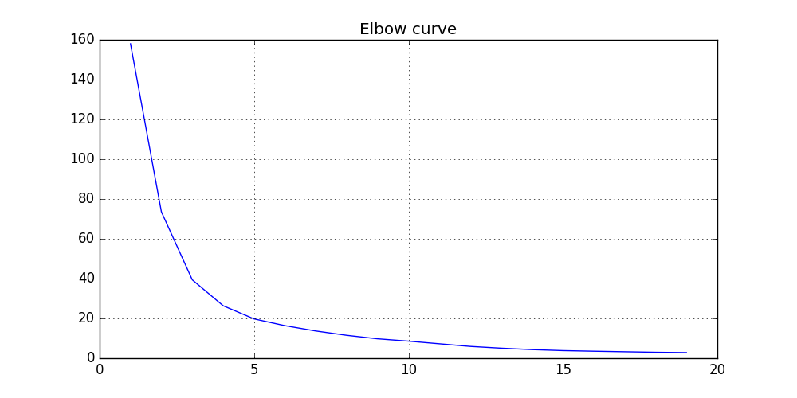
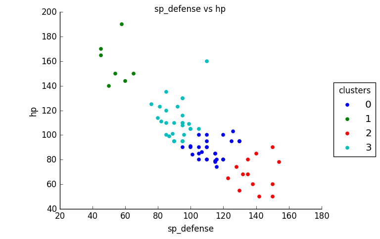
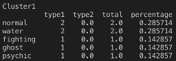
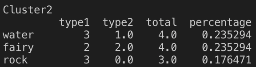
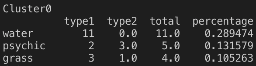
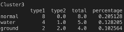
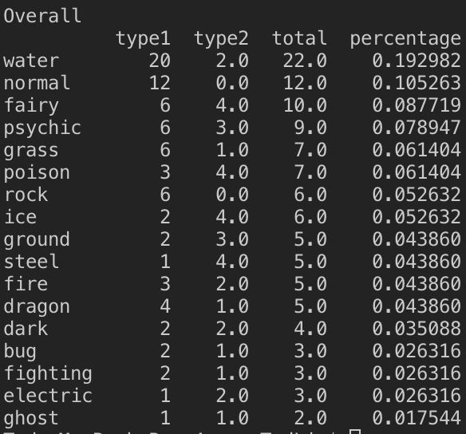

# An application of KMeans Clustering
This is an application of the KMeans Clustering algorithm found in the Python sklearn package of a Pokemon dataset. The dataset was found [here](https://www.kaggle.com/rounakbanik/pokemon) on Kaggle from user: rounakbanik.

<h2>Intro</h2> 
A continuation on the analysis from my previous data exploration, I wanted to look more closely at the top Pokemon in the 'Tank' role, specifically Special Tanks. <a href="https://github.com/tedglim/data_apps/tree/master/src/data_exploration">Previous data exploration.</a>

<h2>Goal</h2> 
The goal is to identify if any groups among the best 'Special Tank' Pokemon exist organically via the KMeans clustering method and discover any trends in those groups if they exist. 

<h2>Procedure</h2> 
To discover if any organic groups exist, I will use KMeans, a popular method for identifying groups in unlabeled data. The general idea is to find some # of groups K and iteratively assign data points to each of the groups based on feature similarity until all data points in each group are as close to similar as possible.
<a href="https://en.wikipedia.org/wiki/K-means_clustering">More Details on KMeans.</a>

<h2>Preprocessing</h2> 
Inspecting the dataset, there were missing values in the columns: height, weight, percentage_male, and type2. For my purposes, only type2 is a concern, so I filtered the dataset down to Pokemon names, base stats, and types and filled empty type2 values with 'None'. Legendaries were not considered as they are usually outliers. Additionally a 'role_index' value was created to help filter the dataset to the top 10% of 'Special Tank' Pokemon.

<h2>Determining K for Kmeans</h2> 

 
To determine K, the Elbow Method is used to determine at what number of groups K does the marginal gain of explained variance drop. Graphically, K is the point where the slope begins to flatten out, the 'elbow' point.  
Looking at the 'Special Tank' role, it seems this point is around 6 clusters; however, 5 could also be an option. It is possible that the reason why there is no clear value of K to use is that KMeans is not the best method to use for this dataset. 

 
Taking a look at our groupings. There are 2 obvious outlier groups. These groups include the Pokemon Shuckle, Blissey, and Chansey. To focus on finding trends among the majority of the Top Special Tank Pokemon, I will exclude these outliers. KMeans does multiple mean calculations and is susceptible to outlier influence.  
Since the Pokemon were already allotted to separate groups, changes should be minimal though. The expectation is that the Elbow Curve is smoothed out along K = 5, 6 and the KMeans plot will bring the other 4 groups into focus.

<h2>KMeans Results</h2> 
Doing it again without the outlier Pokemon:  

 
* The 'elbow' point appears to be at K = 4, so that will be the number of clusters chosen for the KMeans clustering algorithm.  

 
Looking at the groups, they can be described with the following characteristics:  
* <b>Cluster0:</b> Average HP, Above average SP_DEF  
* <b>Cluster1:</b> High HP, Low SP_DEF  
* <b>Cluster2:</b> Low HP, High SP_DEF  
* <b>Cluster3:</b> Above average HP, average SP_DEF   

Relating this back to the previous exploration of this dataset, here's a type distribution across the different clusters.
<h3>Cluster1 + Cluster2</h3>

 
* These clusters are characterized by high stats in one area and low stats in the other.
* These are not too interesting to look at for type distribution as type frequency is fairly even across the board.

<h3>Cluster0 + Cluster3</h3>

 
* These clusters can be characterized as being 'middle-of-the-way' clusters, being average to above-average in SP_DEF and HP stats.  
* Impressively, 30% of Cluster0 is comprised of Water Pokemon while 20% of Cluster3 are Normal Types.  
* Water Pokemon seem to appear frequently in the 'middle-of-the-way' clusters for the 'Special Tank' role.

<h3>Overall Type Distribution among Top 10%</h3>

 
* Water and Normal types combine for ~30% of the Top 10% of Special Tank Pokemon. This is surprising to find as the [previous observation](https://github.com/tedglim/data_apps/tree/master/src/data_exploration) of these types were that the average Water/Normal type Pokemon were relatively poor Special Tanks.
* Honorable mentions go to Fairy and Psychic types which make up ~16% of the Top 10% of Special Tank Pokemon. In the previous exploration of the dataset, they were found to be above average Special Tanks and therefore are less surprising to find in the Top 10%.
* Flying is the only type to not make an appearance in the Top 10% of Special Tanks.

<h2>Summary</h2> 
This KMeans approach gave an additional way to group Pokemon who are apt in the Special Tank role besides their type. It showed that Pokemon could be grouped by the stat distribution that determines their compatibility with being a Special Tank.   
It also gave insight to how the average Pokemon's inclination toward being a Special Tank should not be seen as representative of all Pokemon of the same type, looking specifically at the findings on Water/Normal Pokemon.   
With the difficulty of finding trends in type distribution for this role, it suggests that Pokemon designers ensured that various Pokemon types could excel at the Special Tank role in order for players to have more options when creating their Pokemon parties.  
If this procedure were to be replicated with other roles, it would be expected that certain type(s) do excel in a role, but there would be enough Pokemon type diversity in that role to make weaker trends related to type distribution less obvious. 
