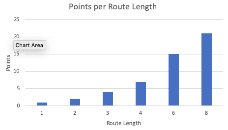
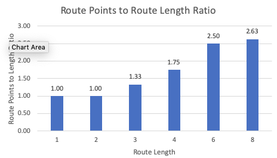
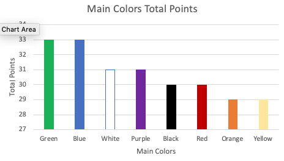
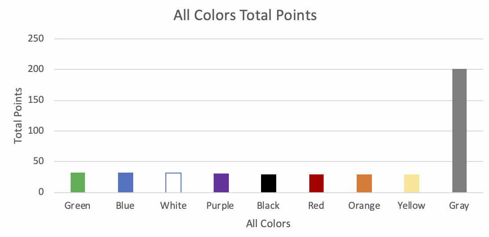

# Ticket to Ride Europe Analysis
<h2>Intro</h2>
Ticket to Ride Europe(TTRE) is a multiplayer board game where players use matching Train Cards to build railway routes between cities to earn the most points. 
This analysis aims to inform players's decision-making by illustrating to what degree claiming routes and completing Destination Tickets can maximize their points earned per Train Card used.

<h2>Claiming Routes</h2>
<h3>Route Length</h3>
In TTRE, players will earn more points for claiming longer routes, making it more efficient to use Train Cards on longer routes. 

 
From this observation, a player may notice that a simple strategy is to claim the longest routes ASAP. 
<h3>Route Colors</h3>
Train Routes come in 9 different colors: 8 Main Colors (Green, Blue, White, Purple, Black, Red, Orange, Yellow) and 1 "Wild" Color (Gray). We first see which color of routes yield the most total points.

 
We see that Green/Blue are the colors that have the most potential points out of the main colors, while Orange/Yellow have the least potential points. However, both pale in comparison to the total potential points that the Gray routes offer. 
We can  look at why this is the case in this breakdown of the routes.

 
This table suggests the colors that yield the most points are generally the ones with the most longest routes. E.g. Green/Blue have the most length 4 routes out of the main colors, so they yield more points than the other main colors. 
Since there are many rounds in the game where players will be holding cards, holding the higher value Green/Blue train color cards will give you a better chance to get the longer routes as well as deny other players from getting those points.

<h2>Destination Tickets</h2>
Ticket Efficiency
Instead of focusing on which Destination Tickets give the most points, we will look at the Destination Tickets that give the best value for each train card used.
We measure the destination ticket value by looking at the (Destination Ticket points + Points per Route Length) / (Route Length). To calculate the Points per Route Length for each Destination Ticket, we assume the shortest route is the shortest possible path in length to get from city A to city B.

 
The first observation is that Destination Tickets make routes point efficient. With all tickets valuing a point efficiency >2, this means that all routes <= length 4 that contribute to a Destination Ticket are more point efficient than a standalone route of length 4.
The next observation is the outlier in the [3.1, 3.2] bin, the Palermo to Constantinople Destination Ticket. Looking at this ticket, it is the only ticket to utilize a length 6 route in its shortest path, making it very point efficient.
We look at a table of the top 20 most efficient destination tickets

 
Here we see that the Top 11 tickets upon completion make routes as efficient as length 6 routes.
Additionally, we notice that the more efficient Destination Tickets all incorporate a length 4 Route in their shortest route path.
One possible strategy here may be to complete high value destination tickets, ones that include a length 4 Route in their shortest route, ASAP.

<h2>Conclusion</h2>
What we can draw from this analysis is that the length 8 route, the 2 length 6 routes, and Destination Tickets with at least 1 length 4 route in its shortest path are high value objectives to claim while playing TTRE.
Another dimension to this game is about turn efficiency. Should you simply wait and draw until you have 45 train cars in your hand and then try to use your train cars all at once?
How does all of this change with the number of players?
Easy to play hard to master games that many designers aspire to make.
