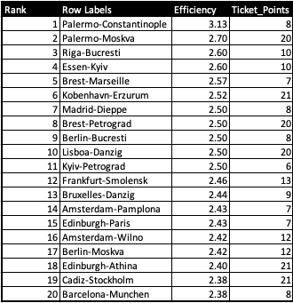

# Ticket to Ride Europe Analysis
<h2>Intro</h2>
Ticket to Ride Europe(TTRE) is a multiplayer board game where players use matching Train Cards to build railway routes between cities to earn the most points.  

This analysis aims to inform players's decision-making by illustrating to what degree claiming routes and completing Destination Tickets can maximize their points earned per Train Card used. 

<h2>Claiming Routes</h2>
<h3>Route Length</h3>
In TTRE, players exchange Train Cards to claim routes with a 1 to 1 exchange rate. However, players will earn more points for claiming longer routes. This means that it is more efficient to use Train Cards on longer routes.

  
From this observation, a player may notice that a simple strategy to use in TTRE is to claim the longest routes as quickly as possible because they give a player the most points per Train Card. 

<h3>Route Colors</h3>
Train Routes in TTRE come in 9 different colors: 8 Main Colors (Green, Blue, White, Purple, Black, Red, Orange, Yellow) and 1 "Wild" Color (Gray). We first see which color of routes yield the most total points.

  
Green/Blue have the most potential points out of the main colors, while Orange/Yellow have the least potential points. However, both pale in comparison to the total potential points that the Gray routes offer. 
We look at why this is the case in this breakdown of the routes.

 

This table suggests that the colors that yield the most points are generally the ones with the most longest routes (E.g. Green/Blue have the most length 4 routes out of the main colors, so they yield more points than the other main colors). 

Since players will be holding cards throughout the game, holding the higher value Green/Blue Train Cards may give a player a better chance to claim longer routes, while denying other palyers from getting those points.

<h2>Destination Tickets</h2>
<h3>Ticket Efficiency</h3>
Instead of focusing on which Destination Tickets give the most points, we want to know which Destination Tickets give the most points per Train Card used. 

We measure the value of Destination Tickets by taking the (Destination Ticket Points + Points per Route Length) / (Route Length). To calculate the Points per Route Length for each Destination Ticket, we assume the Route Length is the shortest possible path from city A to city B on the Destination Ticket <a href="https://boardgamegeek.com/thread/339111/ttr-europe-ticket-analysis">(Credits to gunnarorn for compiling this information)</a>.

 

The first observation is that Destination Tickets make routes very point efficient. All Destination Tickets have a greater than 2 Point to Route Length Ratio. This means that all routes of length less than or equal to 4 that contribute to a Destination Ticket are more point efficient than a standalone route of length 4. 

The next observation is the outlier in the [3.1, 3.2] bin, the 'Palermo to Constantinople' Destination Ticket. This is the only ticket to utilize a route greater than length 4 in its shortest path (it uses a lenght 6 route), making it very point efficient. 

We look at a table of the top 20 most efficient Destination Tickets.

 

Here we see that the Top 11 Destination Tickets upon completion make the routes that were used to complete them as efficient as standalone length 6 routes. Additionally, we notice that the more efficient Destination Tickets all incorporate at least 1 length 4 route in their shortest route path. 

One possible strategy that arises from this observation is to complete as many high value Destination Tickets, ones that include a length 4 Route in their shortest route, as soon as possible.

<h2>Conclusion</h2>
From this analysis, we takeaway that the length 8 route, the 2 length 6 routes, and Destination Tickets with at least 1 length 4 route in its shortest path are high value objectives to claim while playing TTRE because they maximize a player's points per Train Card used.  

What arose from this analysis were two basic strategies: claiming longest routes and completing point efficient Destination Tickets. It would be interesting to discuss which strategy is appropriate for what situations as both have pros and cons.  

With the longest route strategy, players are not claiming routes frequently, but they are turn-efficient; that is, they use many Train Cards in a single turn for the most amount of points. With the Destination Tickets, players make shorter routes more point efficient, but they take more turns to use the same amount of Train Cards for a similar amount of points. The question is then is the Longest Route strategy better because it finishes more quickly? Another dimension to look into would be how each strategy is affected with a different number of players. 

TTRE is one of those easy to learn but hard to master games where it may be only experience playing the game may give us the answers.
